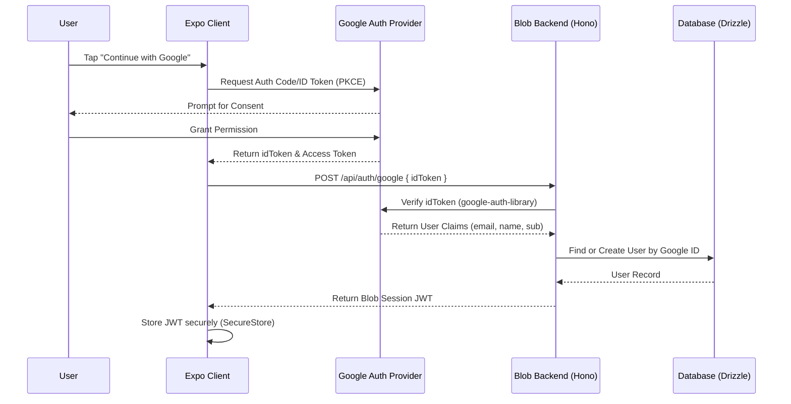

# Google OAuth Flow Proposal

This document outlines a secure, lean, and scalable implementation of Google Sign-In for **Blob**, bridging the Expo mobile client and the Cloudflare Workers backend without relying on heavy third-party authentication services.

## High-Level Architecture

Blob uses a stateless, token-based authentication system. The client authenticates with Google, obtains an `idToken`, and exchanges it for a custom **Blob Session Token (JWT)** from our backend.

## Implementation Details

### 1. Client Side (Mobile)
We will use `expo-auth-session` which is the standard, future-proof way to handle OAuth in Expo.

- **Library**: `expo-auth-session/providers/google`
- **Configuration**:
  - Web Client ID (for verification)
  - iOS/Android Client IDs
- **Flow**:
  1. Initialize the Google request.
  2. Trigger the prompt.
  3. On success, capture the `idToken`.
  4. Send `idToken` to `POST /api/v1/auth/google`.

### 2. Backend (Cloudflare Workers / Hono)
The backend must verify that the token received is genuine and intended for our app.

- **Verification**: Use `google-auth-library` or fetch Google's public keys (`https://www.googleapis.com/oauth2/v3/certs`) to verify the JWT signature locally (more performant for Workers).
- **Validation**:
  - `aud` (Audience) matches our Client ID.
  - `iss` (Issuer) is `accounts.google.com`.
  - `exp` (Expiry) has not passed.
- **Session**: Once verified, issue a short-lived JWT signed with a secret stored in Cloudflare Secrets.

## Security Best Practices

1.  **PKCE (Proof Key for Code Exchange)**: Mandatory for public clients (mobile apps) to prevent authorization code injection.
2.  **ID Token verification**: Never rely on a user's email sent directly from the client. Always verify the `idToken` on the server.
3.  **Stateless Sessions**: Use JWTs stored in Expo's `SecureStore` to maintain high scalability and low latency on the edge (Cloudflare).
4.  **Scopes**: Minimum viable scopes requested (`openid`, `profile`, `email`).

## Why this approach?
- **No Vendor Lock-in**: We own the user database and logic.
- **Cost**: Zero external costs (Clerk/Auth0/Supabase have tiers that eventually scale).
- **Performance**: Direct integration with Hono means sub-100ms auth cycles.
- **Modern**: Fully supports Expo's latest standards (Go vs Development Builds).

---

**Proposed by**: [Aditya Shirsatrao](https://github.com/adityashirsatrao007)
**Status**: Proposal for Issue #16
